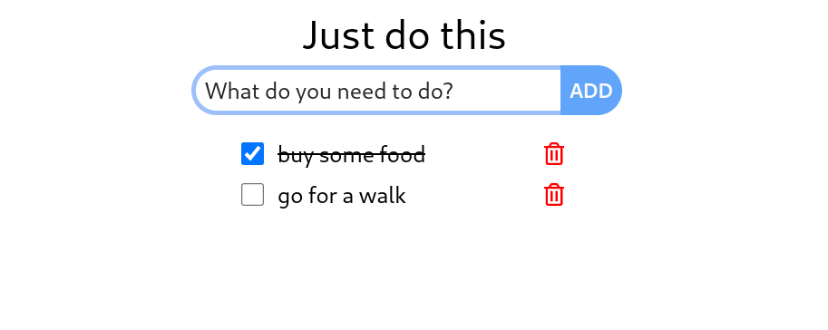

## Wygląd



## Technologie

Frontend:

- react.js
- tailwindCSS
- vite
- typescript

Backend:

- express.js
- REST API with swagger
- TypeORM
- SQLite

## Instalacja

```bash
git clone <repo_link>
```

### Backend

```bash
cd backend
npm i
npm start
```

Na stronce mamy 2 endpointy:  
http://localhost:3000/tasks -> zadanka  
http://localhost:3000/api-docs -> dokumentacja API

### Frontend

```bash
cd frontend
npm i
npm run dev
```
